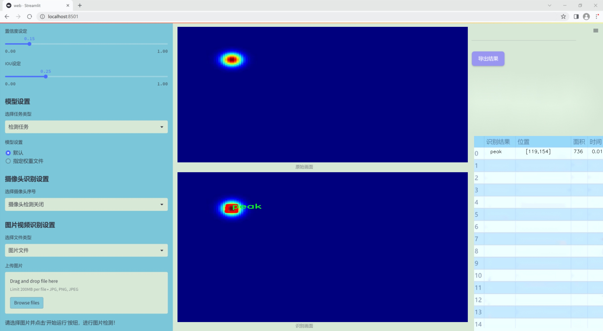
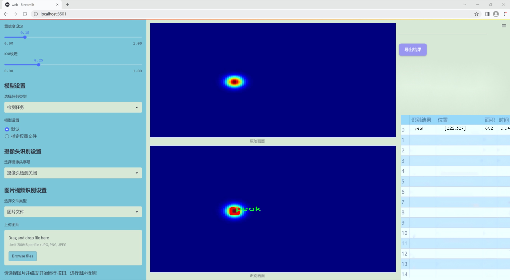
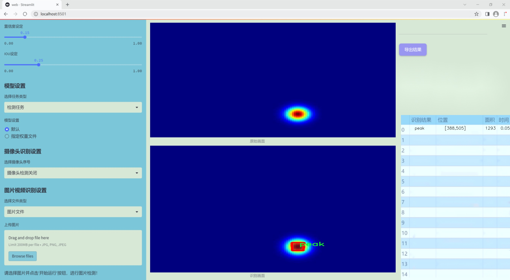
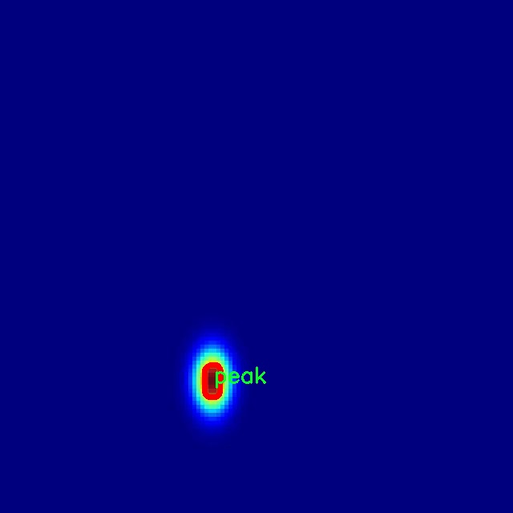
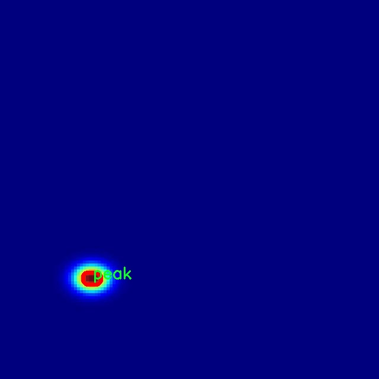
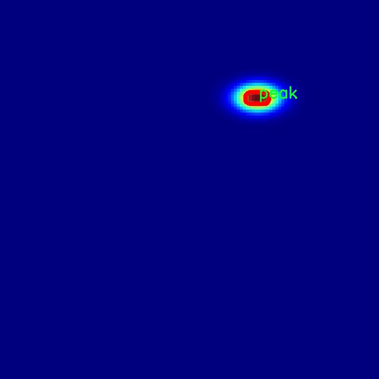
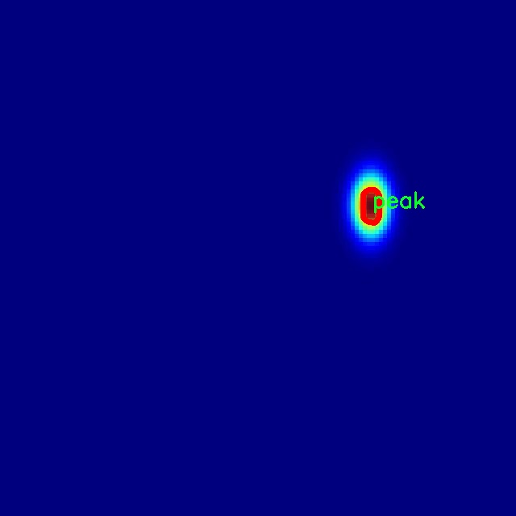
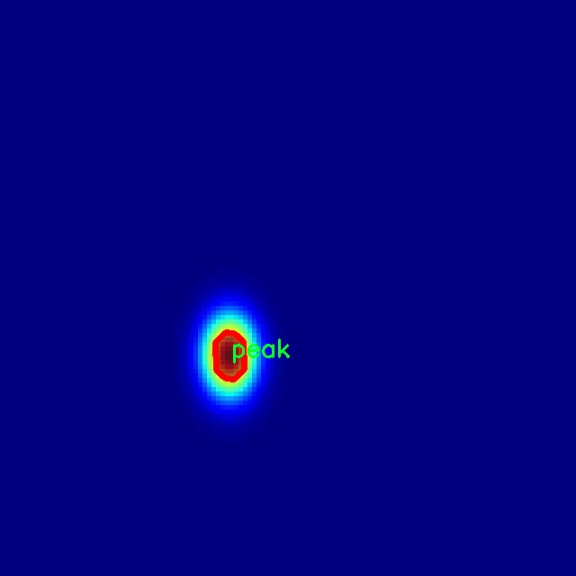

### 1.背景意义

研究背景与意义

随着计算机视觉技术的迅猛发展，目标检测与实例分割在各个领域的应用日益广泛，尤其是在医学影像分析、自动驾驶、智能监控等场景中，准确的物体识别和定位能力显得尤为重要。YOLO（You Only Look Once）系列模型因其高效的实时检测能力和较好的准确性，成为了目标检测领域的热门选择。近年来，YOLOv11作为该系列的最新版本，通过引入更为先进的网络结构和优化算法，进一步提升了检测精度和速度。然而，现有的YOLOv11模型在特定应用场景下仍存在一定的局限性，尤其是在处理复杂背景或小目标时，检测性能有待提高。

本研究旨在基于改进的YOLOv11模型，构建一个专门针对峰值检测的系统。该系统将利用一个包含1500张图像的专用数据集——Hedaya Batch_1，该数据集专注于“峰值”这一单一类别的实例分割。通过对数据集的深入分析与处理，我们期望能够在模型训练过程中充分挖掘图像中的特征信息，提升模型对峰值的检测能力。数据集中对每张图像的预处理，包括自动方向调整和统一尺寸缩放，为模型提供了更为规范的输入，有助于提高训练效率和检测精度。

此外，峰值检测在多个领域中具有重要的应用价值，例如在地质勘探中识别地形特征、在气象监测中分析气候变化、在生物医学中检测生物标志物等。因此，构建一个高效的峰值检测系统，不仅能够推动计算机视觉技术的发展，还能为相关领域的研究与应用提供有力支持。通过本项目的实施，我们希望能够为峰值检测技术的进步贡献一份力量，同时为未来的研究奠定基础。

### 2.视频效果

[2.1 视频效果](https://www.bilibili.com/video/BV1WoBTYaEMu/)

### 3.图片效果







##### [项目涉及的源码数据来源链接](https://kdocs.cn/l/cszuIiCKVNis)**

注意：本项目提供训练的数据集和训练教程,由于版本持续更新,暂不提供权重文件（best.pt）,请按照6.训练教程进行训练后实现上图演示的效果。

### 4.数据集信息

##### 4.1 本项目数据集类别数＆类别名

nc: 1
names: ['peak']


该项目为【图像分割】数据集，请在【训练教程和Web端加载模型教程（第三步）】这一步的时候按照【图像分割】部分的教程来训练

##### 4.2 本项目数据集信息介绍

本项目数据集信息介绍

本项目所使用的数据集名为“Hedaya Batch_1”，其主要目的是为改进YOLOv11的峰值检测系统提供高质量的训练数据。该数据集专注于单一类别的物体检测，具体类别为“peak”，即峰值。这一选择反映了项目的核心目标，即在特定的应用场景中，准确识别和定位峰值特征，以提升模型的性能和实用性。

“Hedaya Batch_1”数据集的构建经过精心设计，旨在确保数据的多样性和代表性，以便于模型在实际应用中能够更好地泛化。数据集中包含了大量的图像样本，这些样本在不同的环境、光照条件和视角下捕捉到的峰值特征，涵盖了各种可能的变异性。这种多样性不仅有助于模型学习到更为全面的特征表示，还能提高其在真实场景中的鲁棒性。

在数据集的标注过程中，采用了高标准的标注流程，确保每个图像中的峰值都被准确标识。标注人员经过专业培训，能够有效区分不同类型的峰值特征，确保数据的高质量。这种高质量的标注为后续的模型训练提供了坚实的基础，使得YOLOv11能够在学习过程中更好地理解峰值的特征和位置。

总之，“Hedaya Batch_1”数据集不仅为改进YOLOv11的峰值检测系统提供了必要的训练素材，也为后续的研究和应用奠定了基础。通过对这一数据集的深入分析和应用，期望能够在峰值检测领域取得显著的进展，为相关技术的发展贡献力量。











### 5.全套项目环境部署视频教程（零基础手把手教学）

[5.1 所需软件PyCharm和Anaconda安装教程（第一步）](https://www.bilibili.com/video/BV1BoC1YCEKi/?spm_id_from=333.999.0.0&vd_source=bc9aec86d164b67a7004b996143742dc)


[5.2 安装Python虚拟环境创建和依赖库安装视频教程（第二步）](https://www.bilibili.com/video/BV1ZoC1YCEBw?spm_id_from=333.788.videopod.sections&vd_source=bc9aec86d164b67a7004b996143742dc)

### 6.改进YOLOv11训练教程和Web_UI前端加载模型教程（零基础手把手教学）

[6.1 改进YOLOv11训练教程和Web_UI前端加载模型教程（第三步）](https://www.bilibili.com/video/BV1BoC1YCEhR?spm_id_from=333.788.videopod.sections&vd_source=bc9aec86d164b67a7004b996143742dc)


按照上面的训练视频教程链接加载项目提供的数据集，运行train.py即可开始训练



     Epoch   gpu_mem       box       obj       cls    labels  img_size
     1/200     20.8G   0.01576   0.01955  0.007536        22      1280: 100%|██████████| 849/849 [14:42<00:00,  1.04s/it]
               Class     Images     Labels          P          R     mAP@.5 mAP@.5:.95: 100%|██████████| 213/213 [01:14<00:00,  2.87it/s]
                 all       3395      17314      0.994      0.957      0.0957      0.0843

     Epoch   gpu_mem       box       obj       cls    labels  img_size
     2/200     20.8G   0.01578   0.01923  0.007006        22      1280: 100%|██████████| 849/849 [14:44<00:00,  1.04s/it]
               Class     Images     Labels          P          R     mAP@.5 mAP@.5:.95: 100%|██████████| 213/213 [01:12<00:00,  2.95it/s]
                 all       3395      17314      0.996      0.956      0.0957      0.0845

     Epoch   gpu_mem       box       obj       cls    labels  img_size
     3/200     20.8G   0.01561    0.0191  0.006895        27      1280: 100%|██████████| 849/849 [10:56<00:00,  1.29it/s]
               Class     Images     Labels          P          R     mAP@.5 mAP@.5:.95: 100%|███████   | 187/213 [00:52<00:00,  4.04it/s]
                 all       3395      17314      0.996      0.957      0.0957      0.0845


###### [项目数据集下载链接](https://kdocs.cn/l/cszuIiCKVNis)

### 7.原始YOLOv11算法讲解

YOLOv11是一种由Ultralytics公司开发的最新一代目标检测模型，以其增强的特征提取能力和更高的效率在计算机视觉领域引人注目。该模型在架构上进行了关键升级，通过更新主干和颈部结构，显著提高了对复杂视觉场景的理解和处理精度。YOLOv11不仅在目标检测上表现出色，还支持实例分割、图像分类、姿态估计和定向目标检测（OBB）等任务，展示出其多功能性。

与其前身YOLOv8相比，YOLOv11在设计上实现了深度和宽度的改变，同时引入了几个创新机制。其中，C3k2机制是对YOLOv8中的C2f的改进，提升了浅层特征的处理能力；C2PSA机制则进一步优化了特征图的处理流程。解耦头的创新设计，通过增加两个深度卷积（DWConv），提高了模型对细节的感知能力和分类准确性。

在性能上，YOLOv11m模型在COCO数据集上的平均精度（mAP）提高，并减少了22%的参数量，确保了在运算效率上的突破。该模型可以部署在多种平台上，包括边缘设备、云平台以及支持NVIDIA GPU的系统，彰显出卓越的灵活性和适应性。总体而言，YOLOv11通过一系列的创新突破，对目标检测领域产生了深远的影响，并为未来的开发提供了新的研究方向。


****文档**** ： _ _https://docs.ultralytics.com/models/yolo11/__

****代码链接**** ： _ _https://github.com/ultralytics/ultralytics__

******Performance Metrics******


​ ** **关键特性****

****◆**** ** **增强的特征提取能力**** ：YOLO11采用了改进的主干和颈部架构，增强了 ** **特征提取****
能力，能够实现更精确的目标检测和复杂任务的执行。

****◆**** ** **优化的效率和速度****
：YOLO11引入了精细化的架构设计和优化的训练流程，提供更快的处理速度，并在准确性和性能之间保持最佳平衡。

****◆**** ** **参数更少、精度更高****
：通过模型设计的改进，YOLO11m在COCO数据集上实现了更高的平均精度（mAP），同时使用的参数比YOLOv8m少22%，使其在计算上更加高效，而不牺牲准确性。

****◆**** ** **跨环境的适应性**** ：YOLO11可以无缝部署在各种环境中，包括边缘设备、云平台和支持NVIDIA
GPU的系统，确保最大的灵活性。

****◆**** ** **支持广泛任务****
：无论是目标检测、实例分割、图像分类、姿态估计还是定向目标检测（OBB），YOLO11都旨在应对一系列计算机视觉挑战。

****支持的任务和模式****


​YOLO11建立在YOLOv8中引入的多功能模型范围之上，为各种计算机视觉任务提供增强的支持:


​该表提供了YOLO11模型变体的概述，展示了它们在特定任务中的适用性以及与Inference、Validation、Training和Export等操作模式的兼容性。从实时检测到复杂的分割任务
，这种灵活性使YOLO11适用于计算机视觉的广泛应用。

##### yolov11的创新

■ yolov8 VS yolov11

YOLOv5，YOLOv8和YOLOv11均是ultralytics公司的作品，ultralytics出品必属精品。


​ **具体创新点** ：

**① 深度（depth）和宽度 （width）**

YOLOv8和YOLOv11是基本上完全不同。

**② C3k2机制**

C3k2有参数为c3k，其中在网络的浅层c3k设置为False。C3k2就相当于YOLOv8中的C2f。


​ **③ C2PSA机制**

下图为C2PSA机制的原理图。


​ **④ 解耦头**

解耦头中的分类检测头增加了两个 **DWConv** 。


▲Conv

    
    
    def autopad(k, p=None, d=1):  # kernel, padding, dilation
    
        """Pad to 'same' shape outputs."""
    
        if d > 1:
    
            k = d * (k - 1) + 1 if isinstance(k, int) else [d * (x - 1) + 1 for x in k]  # actual kernel-size
    
        if p is None:
    
            p = k // 2 if isinstance(k, int) else [x // 2 for x in k]  # auto-pad
    
    return p
    
    
    class Conv(nn.Module):
    
        """Standard convolution with args(ch_in, ch_out, kernel, stride, padding, groups, dilation, activation)."""
    
    
        default_act = nn.SiLU()  # default activation
    
    
        def __init__(self, c1, c2, k=1, s=1, p=None, g=1, d=1, act=True):
    
            """Initialize Conv layer with given arguments including activation."""
    
            super().__init__()
    
            self.conv = nn.Conv2d(c1, c2, k, s, autopad(k, p, d), groups=g, dilation=d, bias=False)
    
            self.bn = nn.BatchNorm2d(c2)
    
            self.act = self.default_act if act is True else act if isinstance(act, nn.Module) else nn.Identity()
    
    
        def forward(self, x):
    
            """Apply convolution, batch normalization and activation to input tensor."""
    
            return self.act(self.bn(self.conv(x)))
    
    
        def forward_fuse(self, x):
    
            """Perform transposed convolution of 2D data."""
    
            return self.act(self.conv(x))

▲Conv2d

    
    
    torch.nn.Conv2d(in_channels, out_channels, kernel_size, stride=1, padding=0, dilation=1, groups=1, bias=True, padding_mode='zeros')

▲DWConv

DWConv ** **代表 Depthwise Convolution（深度卷积）****
，是一种在卷积神经网络中常用的高效卷积操作。它主要用于减少计算复杂度和参数量。

    
    
    class DWConv(Conv):
    
        """Depth-wise convolution."""
    
    
        def __init__(self, c1, c2, k=1, s=1, d=1, act=True):  # ch_in, ch_out, kernel, stride, dilation, activation
    
            """Initialize Depth-wise convolution with given parameters."""
    
            super().__init__(c1, c2, k, s, g=math.gcd(c1, c2), d=d, act=act)


### 8.200+种全套改进YOLOV11创新点原理讲解

#### 8.1 200+种全套改进YOLOV11创新点原理讲解大全

由于篇幅限制，每个创新点的具体原理讲解就不全部展开，具体见下列网址中的改进模块对应项目的技术原理博客网址【Blog】（创新点均为模块化搭建，原理适配YOLOv5~YOLOv11等各种版本）

[改进模块技术原理博客【Blog】网址链接](https://gitee.com/qunmasj/good)


#### 8.2 精选部分改进YOLOV11创新点原理讲解

###### 这里节选部分改进创新点展开原理讲解(完整的改进原理见上图和[改进模块技术原理博客链接](https://gitee.com/qunmasj/good)【如果此小节的图加载失败可以通过CSDN或者Github搜索该博客的标题访问原始博客，原始博客图片显示正常】

### 动态蛇形卷积Dynamic Snake Convolution

参考论文： 2307.08388.pdf (arxiv.org)

血管、道路等拓扑管状结构的精确分割在各个领域都至关重要，确保下游任务的准确性和效率。 然而，许多因素使任务变得复杂，包括薄的局部结构和可变的全局形态。在这项工作中，我们注意到管状结构的特殊性，并利用这些知识来指导我们的 DSCNet 在三个阶段同时增强感知：特征提取、特征融合、 和损失约束。 首先，我们提出了一种动态蛇卷积，通过自适应地关注细长和曲折的局部结构来准确捕获管状结构的特征。 随后，我们提出了一种多视图特征融合策略，以补充特征融合过程中多角度对特征的关注，确保保留来自不同全局形态的重要信息。 最后，提出了一种基于持久同源性的连续性约束损失函数，以更好地约束分割的拓扑连续性。 2D 和 3D 数据集上的实验表明，与多种方法相比，我们的 DSCNet 在管状结构分割任务上提供了更好的准确性和连续性。 我们的代码是公开的。 
主要的挑战源于细长微弱的局部结构特征与复杂多变的全局形态特征。本文关注到管状结构细长连续的特点，并利用这一信息在神经网络以下三个阶段同时增强感知：特征提取、特征融合和损失约束。分别设计了动态蛇形卷积（Dynamic Snake Convolution），多视角特征融合策略与连续性拓扑约束损失。 

我们希望卷积核一方面能够自由地贴合结构学习特征，另一方面能够在约束条件下不偏离目标结构太远。在观察管状结构的细长连续的特征后，脑海里想到了一个动物——蛇。我们希望卷积核能够像蛇一样动态地扭动，来贴合目标的结构。

我们希望卷积核一方面能够自由地贴合结构学习特征，另一方面能够在约束条件下不偏离目标结构太远。在观察管状结构的细长连续的特征后，脑海里想到了一个动物——蛇。我们希望卷积核能够像蛇一样动态地扭动，来贴合目标的结构。


### DCNV2融入YOLOv11
DCN和DCNv2（可变性卷积）
网上关于两篇文章的详细描述已经很多了，我这里具体的细节就不多讲了，只说一下其中实现起来比较困惑的点。（黑体字会讲解）

DCNv1解决的问题就是我们常规的图像增强，仿射变换（线性变换加平移）不能解决的多种形式目标变换的几何变换的问题。如下图所示。

可变性卷积的思想很简单，就是讲原来固定形状的卷积核变成可变的。如下图所示：


首先来看普通卷积，以3x3卷积为例对于每个输出y(p0)，都要从x上采样9个位置，这9个位置都在中心位置x(p0)向四周扩散得到的gird形状上，(-1,-1)代表x(p0)的左上角，(1,1)代表x(p0)的右下角，其他类似。

用公式表示如下：


可变性卷积Deformable Conv操作并没有改变卷积的计算操作，而是在卷积操作的作用区域上，加入了一个可学习的参数∆pn。同样对于每个输出y(p0)，都要从x上采样9个位置，这9个位置是中心位置x(p0)向四周扩散得到的，但是多了 ∆pn，允许采样点扩散成非gird形状。


偏移量是通过对原始特征层进行卷积得到的。比如输入特征层是w×h×c，先对输入的特征层进行卷积操作，得到w×h×2c的offset field。这里的w和h和原始特征层的w和h是一致的，offset field里面的值是输入特征层对应位置的偏移量，偏移量有x和y两个方向，所以offset field的channel数是2c。offset field里的偏移量是卷积得到的，可能是浮点数，所以接下来需要通过双向性插值计算偏移位置的特征值。在偏移量的学习中，梯度是通过双线性插值来进行反向传播的。
看到这里是不是还是有点迷茫呢？那到底程序上面怎么实现呢？


事实上由上面的公式我们可以看得出来∆pn这个偏移量是加在原像素点上的，但是我们怎么样从代码上对原像素点加这个量呢？其实很简单，就是用一个普通的卷积核去跟输入图片（一般是输入的feature_map）卷积就可以了卷积核的数量是2N也就是23*3==18（前9个通道是x方向的偏移量，后9个是y方向的偏移量），然后把这个卷积的结果与正常卷积的结果进行相加就可以了。
然后又有了第二个问题，怎么样反向传播呢？为什么会有这个问题呢？因为求出来的偏移量+正常卷积输出的结果往往是一个浮点数，浮点数是无法对应到原图的像素点的，所以自然就想到了双线性差值的方法求出浮点数对应的浮点像素点。


#### DCN v2
对于positive的样本来说，采样的特征应该focus在RoI内，如果特征中包含了过多超出RoI的内容，那么结果会受到影响和干扰。而negative样本则恰恰相反，引入一些超出RoI的特征有助于帮助网络判别这个区域是背景区域。

DCNv1引入了可变形卷积，能更好的适应目标的几何变换。但是v1可视化结果显示其感受野对应位置超出了目标范围，导致特征不受图像内容影响（理想情况是所有的对应位置分布在目标范围以内）。

为了解决该问题：提出v2, 主要有

1、扩展可变形卷积，增强建模能力
2、提出了特征模拟方案指导网络培训：feature mimicking scheme

上面这段话是什么意思呢，通俗来讲就是，我们的可变性卷积的区域大于目标所在区域，所以这时候就会对非目标区域进行错误识别。

所以自然能想到的解决方案就是加入权重项进行惩罚。（至于这个实现起来就比较简单了，直接初始化一个权重然后乘(input+offsets)就可以了）


可调节的RoIpooling也是类似的，公式如下：


### 9.系统功能展示

图9.1.系统支持检测结果表格显示

  图9.2.系统支持置信度和IOU阈值手动调节

  图9.3.系统支持自定义加载权重文件best.pt(需要你通过步骤5中训练获得)

  图9.4.系统支持摄像头实时识别

  图9.5.系统支持图片识别

  图9.6.系统支持视频识别

  图9.7.系统支持识别结果文件自动保存

  图9.8.系统支持Excel导出检测结果数据


### 10. YOLOv11核心改进源码讲解

#### 10.1 kagn_conv.py

以下是对给定代码的核心部分进行提炼和详细注释的结果：

```python
import torch
import torch.nn as nn
from functools import lru_cache

class KAGNConvNDLayer(nn.Module):
    def __init__(self, conv_class, norm_class, conv_w_fun, input_dim, output_dim, degree, kernel_size,
                 groups=1, padding=0, stride=1, dilation=1, dropout: float = 0.0, ndim: int = 2):
        super(KAGNConvNDLayer, self).__init__()
        
        # 初始化参数
        self.inputdim = input_dim  # 输入维度
        self.outdim = output_dim    # 输出维度
        self.degree = degree         # 多项式的度数
        self.kernel_size = kernel_size  # 卷积核大小
        self.padding = padding       # 填充
        self.stride = stride         # 步幅
        self.dilation = dilation     # 膨胀
        self.groups = groups         # 分组卷积的组数
        self.base_activation = nn.SiLU()  # 基础激活函数
        self.conv_w_fun = conv_w_fun  # 卷积权重函数
        self.ndim = ndim             # 数据的维度
        self.dropout = nn.Dropout3d(p=dropout) if ndim == 3 else nn.Dropout2d(p=dropout) if ndim == 2 else nn.Dropout1d(p=dropout) if ndim == 1 else None

        # 参数检查
        if groups <= 0:
            raise ValueError('groups must be a positive integer')
        if input_dim % groups != 0:
            raise ValueError('input_dim must be divisible by groups')
        if output_dim % groups != 0:
            raise ValueError('output_dim must be divisible by groups')

        # 创建基础卷积层和归一化层
        self.base_conv = nn.ModuleList([conv_class(input_dim // groups,
                                                   output_dim // groups,
                                                   kernel_size,
                                                   stride,
                                                   padding,
                                                   dilation,
                                                   groups=1,
                                                   bias=False) for _ in range(groups)])

        self.layer_norm = nn.ModuleList([norm_class(output_dim // groups) for _ in range(groups)])

        # 初始化多项式权重
        poly_shape = (groups, output_dim // groups, (input_dim // groups) * (degree + 1)) + tuple(kernel_size for _ in range(ndim))
        self.poly_weights = nn.Parameter(torch.randn(*poly_shape))  # 多项式权重
        self.beta_weights = nn.Parameter(torch.zeros(degree + 1, dtype=torch.float32))  # beta权重

        # 权重初始化
        for conv_layer in self.base_conv:
            nn.init.kaiming_uniform_(conv_layer.weight, nonlinearity='linear')
        nn.init.kaiming_uniform_(self.poly_weights, nonlinearity='linear')
        nn.init.normal_(self.beta_weights, mean=0.0, std=1.0 / ((kernel_size ** ndim) * self.inputdim * (self.degree + 1.0)))

    def beta(self, n, m):
        # 计算beta值
        return (
            ((m + n) * (m - n) * n ** 2) / (m ** 2 / (4.0 * n ** 2 - 1.0))
        ) * self.beta_weights[n]

    @lru_cache(maxsize=128)  # 使用缓存避免重复计算
    def gram_poly(self, x, degree):
        # 计算Gram多项式
        p0 = x.new_ones(x.size())  # p0初始化为1

        if degree == 0:
            return p0.unsqueeze(-1)

        p1 = x
        grams_basis = [p0, p1]

        for i in range(2, degree + 1):
            p2 = x * p1 - self.beta(i - 1, i) * p0  # 递归计算多项式
            grams_basis.append(p2)
            p0, p1 = p1, p2

        return torch.cat(grams_basis, dim=1)  # 连接所有多项式

    def forward_kag(self, x, group_index):
        # 前向传播，处理每个组的输入
        basis = self.base_conv[group_index](self.base_activation(x))  # 基础卷积
        x = torch.tanh(x).contiguous()  # 对输入进行tanh归一化

        if self.dropout is not None:
            x = self.dropout(x)  # 应用dropout

        grams_basis = self.base_activation(self.gram_poly(x, self.degree))  # 计算Gram多项式基
        y = self.conv_w_fun(grams_basis, self.poly_weights[group_index], stride=self.stride, dilation=self.dilation, padding=self.padding, groups=1)  # 卷积操作
        y = self.base_activation(self.layer_norm[group_index](y + basis))  # 归一化和激活

        return y

    def forward(self, x):
        # 前向传播，处理所有组的输入
        split_x = torch.split(x, self.inputdim // self.groups, dim=1)  # 按组分割输入
        output = []
        for group_ind, _x in enumerate(split_x):
            y = self.forward_kag(_x.clone(), group_ind)  # 对每个组调用forward_kag
            output.append(y.clone())
        y = torch.cat(output, dim=1)  # 合并所有组的输出
        return y

# 3D卷积层
class KAGNConv3DLayer(KAGNConvNDLayer):
    def __init__(self, input_dim, output_dim, kernel_size, degree=3, groups=1, padding=0, stride=1, dilation=1, dropout: float = 0.0):
        super(KAGNConv3DLayer, self).__init__(nn.Conv3d, nn.InstanceNorm3d, conv3d, input_dim, output_dim, degree, kernel_size, groups=groups, padding=padding, stride=stride, dilation=dilation, ndim=3, dropout=dropout)

# 2D卷积层
class KAGNConv2DLayer(KAGNConvNDLayer):
    def __init__(self, input_dim, output_dim, kernel_size, degree=3, groups=1, padding=0, stride=1, dilation=1, dropout: float = 0.0, norm_layer=nn.InstanceNorm2d):
        super(KAGNConv2DLayer, self).__init__(nn.Conv2d, norm_layer, conv2d, input_dim, output_dim, degree, kernel_size, groups=groups, padding=padding, stride=stride, dilation=dilation, ndim=2, dropout=dropout)

# 1D卷积层
class KAGNConv1DLayer(KAGNConvNDLayer):
    def __init__(self, input_dim, output_dim, kernel_size, degree=3, groups=1, padding=0, stride=1, dilation=1, dropout: float = 0.0):
        super(KAGNConv1DLayer, self).__init__(nn.Conv1d, nn.InstanceNorm1d, conv1d, input_dim, output_dim, degree, kernel_size, groups=groups, padding=padding, stride=stride, dilation=dilation, ndim=1, dropout=dropout)
```

### 代码分析
1. **KAGNConvNDLayer**: 这是一个通用的卷积层类，支持任意维度的卷积（1D, 2D, 3D）。它使用多项式基函数进行卷积操作，并实现了dropout和归一化功能。
2. **beta和gram_poly方法**: 这两个方法用于计算多项式的系数和基函数，分别用于后续的卷积计算。
3. **forward_kag和forward方法**: 这两个方法实现了前向传播的逻辑，分别处理单个组的输入和所有组的输入。
4. **KAGNConv3DLayer, KAGNConv2DLayer, KAGNConv1DLayer**: 这三个类分别是对3D、2D和1D卷积的具体实现，继承自`KAGNConvNDLayer`。

### 总结
该代码实现了一个灵活的卷积层，能够处理多维数据，并通过多项式基函数增强了卷积操作的表达能力。

这个程序文件定义了一个名为 `KAGNConvNDLayer` 的神经网络层，以及其一维、二维和三维的特化版本。该层的设计灵感来源于一种基于 Legendre 多项式的卷积操作，旨在增强卷积神经网络的表达能力。

首先，`KAGNConvNDLayer` 类继承自 `nn.Module`，是一个通用的卷积层，支持任意维度的卷积操作。构造函数中接受多个参数，包括输入和输出维度、卷积核大小、分组数、填充、步幅、扩张率、丢弃率等。它还接收一个用于计算卷积权重的函数和一个激活函数。根据输入的维度，程序会创建相应的丢弃层（Dropout），并检查分组数和维度的有效性。

在初始化过程中，类创建了多个基础卷积层和归一化层，这些层被组织成 `ModuleList`，以便于管理和训练。卷积层的权重通过 Kaiming 均匀分布初始化，以提高训练的起始效果。同时，程序还初始化了多项式权重和 beta 权重。

`beta` 方法用于计算 Legendre 多项式的系数，而 `gram_poly` 方法则生成指定度数的 Legendre 多项式。该方法使用了 LRU 缓存，以避免重复计算。

在 `forward_kag` 方法中，输入首先经过基础激活函数和卷积层的线性变换，然后进行归一化处理。接着，输入被转换为 [-1, 1] 的范围，以便于稳定地计算 Legendre 多项式。计算得到的多项式基函数与多项式权重进行卷积，最后通过归一化层和激活函数得到输出。

`forward` 方法则负责处理输入数据，首先将输入按组分割，然后对每个组调用 `forward_kag` 方法，最后将所有组的输出拼接在一起。

此外，文件中还定义了三个特化类：`KAGNConv3DLayer`、`KAGNConv2DLayer` 和 `KAGNConv1DLayer`，分别用于三维、二维和一维卷积操作。这些类通过调用父类的构造函数，传入相应的卷积和归一化层，简化了多维卷积层的创建过程。

整体而言，这个文件实现了一种灵活且强大的卷积层，结合了传统卷积和基于多项式的操作，旨在提高深度学习模型的性能。

#### 10.2 block.py

以下是代码中最核心的部分，并附上详细的中文注释：

```python
import torch
import torch.nn as nn
import torch.nn.functional as F

def autopad(k, p=None, d=1):  # kernel, padding, dilation
    """自动填充以保持输出形状相同。"""
    if d > 1:
        k = d * (k - 1) + 1 if isinstance(k, int) else [d * (x - 1) + 1 for x in k]  # 实际的卷积核大小
    if p is None:
        p = k // 2 if isinstance(k, int) else [x // 2 for x in k]  # 自动填充
    return p

class Conv(nn.Module):
    """自定义卷积层，包含卷积和批归一化。"""
    def __init__(self, in_channels, out_channels, kernel_size=3, stride=1, padding=None, groups=1, act=True):
        super().__init__()
        self.conv = nn.Conv2d(in_channels, out_channels, kernel_size, stride, autopad(kernel_size, padding), groups=groups, bias=False)
        self.bn = nn.BatchNorm2d(out_channels)
        self.act = nn.SiLU() if act else nn.Identity()  # 使用SiLU激活函数

    def forward(self, x):
        """前向传播。"""
        return self.act(self.bn(self.conv(x)))

class Bottleneck(nn.Module):
    """标准瓶颈块，包含两个卷积层。"""
    def __init__(self, c1, c2, shortcut=True, g=1, k=(3, 3), e=0.5):
        super().__init__()
        c_ = int(c2 * e)  # 隐藏通道数
        self.cv1 = Conv(c1, c_, k[0], 1)  # 第一个卷积层
        self.cv2 = Conv(c_, c2, k[1], 1, g=g)  # 第二个卷积层
        self.add = shortcut and c1 == c2  # 是否使用快捷连接

    def forward(self, x):
        """前向传播。"""
        return x + self.cv2(self.cv1(x)) if self.add else self.cv2(self.cv1(x))

class C3k(nn.Module):
    """包含多个瓶颈块的模块。"""
    def __init__(self, c1, c2, n=1, shortcut=False, g=1, e=0.5, k=3):
        super().__init__()
        self.m = nn.Sequential(*(Bottleneck(c1, c2, shortcut, g, k=(k, k), e=e) for _ in range(n)))  # n个瓶颈块

    def forward(self, x):
        """前向传播。"""
        return self.m(x)

class DynamicConv(nn.Module):
    """动态卷积层，使用条件卷积。"""
    def __init__(self, c1, c2, k=1, s=1, p=None, g=1, d=1, act=True, num_experts=4):
        super().__init__()
        self.conv = nn.Sequential(
            DynamicConv_Single(c1, c2, kernel_size=k, stride=s, padding=autopad(k, p, d), dilation=d, groups=g, num_experts=num_experts),
            nn.BatchNorm2d(c2),
            nn.SiLU() if act else nn.Identity()
        )

    def forward(self, x):
        """前向传播。"""
        return self.conv(x)

class FocusedLinearAttention(nn.Module):
    """聚焦线性注意力机制。"""
    def __init__(self, dim, fmapsize):
        super().__init__()
        self.qkv = nn.Conv2d(dim, dim * 3, 1)  # q, k, v的线性变换
        self.proj = nn.Conv2d(dim, dim, 1)  # 输出的线性变换
        self.fmapsize = fmapsize

    def forward(self, x):
        """前向传播。"""
        B, C, H, W = x.shape
        qkv = self.qkv(x).view(B, 3, C, H, W)  # 分离q, k, v
        q, k, v = qkv.unbind(dim=1)  # 分离
        attn = (q @ k.transpose(-2, -1)) * (1.0 / (C ** 0.5))  # 计算注意力
        attn = attn.softmax(dim=-1)  # softmax归一化
        x = (attn @ v).view(B, C, H, W)  # 应用注意力
        return self.proj(x)  # 线性变换

class C3k_FocusedLinearAttention(C3k):
    """使用FocusedLinearAttention的C3k模块。"""
    def __init__(self, c1, c2, n=1, fmapsize=None, shortcut=False, g=1, e=0.5, k=3):
        super().__init__(c1, c2, n, shortcut, g, e, k)
        c_ = int(c2 * e)  # 隐藏通道数
        self.m = nn.Sequential(*(Bottleneck_FocusedLinearAttention(c_, c_, fmapsize, shortcut, g, k=(k, k), e=1.0) for _ in range(n)))

class C3k2_FocusedLinearAttention(C3k2):
    """使用FocusedLinearAttention的C3k2模块。"""
    def __init__(self, c1, c2, n=1, fmapsize=None, c3k=False, e=0.5, g=1, shortcut=True):
        super().__init__(c1, c2, n, c3k, e, g, shortcut)
        self.m = nn.ModuleList(C3k_FocusedLinearAttention(self.c, self.c, 2, fmapsize, shortcut, g) if c3k else Bottleneck_FocusedLinearAttention(self.c, self.c, fmapsize, shortcut, g) for _ in range(n))

# 其他类和方法的核心部分可以类似处理
```

### 注释说明：
1. **autopad**: 该函数用于自动计算卷积的填充，以确保输出形状与输入形状相同。
2. **Conv**: 自定义卷积层，包含卷积、批归一化和激活函数。
3. **Bottleneck**: 标准瓶颈块，包含两个卷积层和可选的快捷连接。
4. **C3k**: 由多个瓶颈块组成的模块。
5. **DynamicConv**: 动态卷积层，使用条件卷积来处理输入。
6. **FocusedLinearAttention**: 实现聚焦线性注意力机制的类。
7. **C3k_FocusedLinearAttention**: 使用聚焦线性注意力的C3k模块。

以上是代码的核心部分和注释，其他部分可以根据需要进行类似的处理。

这个 `block.py` 文件包含了多个深度学习模型组件的实现，主要用于构建各种卷积神经网络（CNN）和注意力机制。以下是对文件中主要内容的逐步说明：

首先，文件导入了一系列必要的库，包括 PyTorch、NumPy 和一些自定义模块。这些模块包含了不同类型的卷积、注意力机制和网络层。

文件的开头定义了一些常用的函数，例如 `autopad` 用于自动计算卷积的填充，`_make_divisible` 用于确保通道数是可分配的。

接下来，定义了一些激活函数的类，如 `swish`、`h_swish` 和 `h_sigmoid`，这些函数在网络中用于引入非线性。

然后，文件中定义了多个网络模块和层，包括：

- **DyHeadBlock** 和 **DyHeadBlockWithDCNV3**：这些模块实现了动态头部块，结合了变形卷积和注意力机制，用于处理多尺度特征。

- **Fusion**：实现了特征融合的功能，可以将多个输入特征图融合成一个输出特征图。

- **Partial_conv3** 和 **Faster_Block**：这些模块用于实现部分卷积和加速块，优化了卷积操作。

- **C3k2_Faster**、**C3k2_ODConv**、**C3k2_EMSCP** 等类：这些类是网络的具体实现，通常用于特定的网络架构，如 YOLO 或其他目标检测网络。

- **RepConv**、**GhostConv** 和 **SMPConv**：这些是轻量级卷积操作，旨在减少计算量和参数数量。

- **Attention** 相关的模块，如 **ChannelAttention_HSFPN** 和 **SMA**，用于引入注意力机制，增强网络对重要特征的关注。

- **ContextGuidedBlock** 和 **PyramidContextExtraction**：这些模块用于上下文引导和特征提取，增强网络对上下文信息的理解。

- **Dilation-wise Residual Block** 和 **Dynamic Group Convolution Shuffle Transformer**：这些模块通过引入膨胀卷积和动态卷积来提高网络的表现。

- **多种注意力机制**：如 **CA_HSFPN**、**GLSA** 和 **SMAFormerBlock**，用于不同的特征融合和注意力计算。

- **各种特征融合模块**：如 **DynamicInterpolationFusion** 和 **GEFM**，用于结合不同来源的特征。

最后，文件中定义了一些用于特定任务的网络结构，如 **C3k2_UniRepLKNetBlock** 和 **C3k2_MogaBlock**，这些结构结合了多种先进的卷积和注意力机制，旨在提高模型的性能。

整体来看，这个文件提供了丰富的模块和工具，可以用于构建复杂的深度学习模型，特别是在计算机视觉任务中。每个模块都可以根据具体需求进行组合和调整，以实现最佳的性能。

#### 10.3 metaformer.py

以下是代码中最核心的部分，并附上详细的中文注释：

```python
import torch
import torch.nn as nn
import torch.nn.functional as F

class MF_Attention(nn.Module):
    """
    自注意力机制实现，源自Transformer模型。
    """
    def __init__(self, dim, head_dim=32, num_heads=None, qkv_bias=False,
                 attn_drop=0., proj_drop=0., proj_bias=False):
        super().__init__()

        # 设置每个头的维度
        self.head_dim = head_dim
        # 缩放因子
        self.scale = head_dim ** -0.5

        # 计算头的数量
        self.num_heads = num_heads if num_heads else dim // head_dim
        if self.num_heads == 0:
            self.num_heads = 1
        
        # 计算注意力的维度
        self.attention_dim = self.num_heads * self.head_dim

        # 定义Q、K、V的线性变换
        self.qkv = nn.Linear(dim, self.attention_dim * 3, bias=qkv_bias)
        # 定义注意力的dropout
        self.attn_drop = nn.Dropout(attn_drop)
        # 定义输出的线性变换
        self.proj = nn.Linear(self.attention_dim, dim, bias=proj_bias)
        # 定义输出的dropout
        self.proj_drop = nn.Dropout(proj_drop)

    def forward(self, x):
        # 获取输入的形状
        B, H, W, C = x.shape
        N = H * W  # 计算总的token数量

        # 计算Q、K、V
        qkv = self.qkv(x).reshape(B, N, 3, self.num_heads, self.head_dim).permute(2, 0, 3, 1, 4)
        q, k, v = qkv.unbind(0)  # 分离Q、K、V

        # 计算注意力权重
        attn = (q @ k.transpose(-2, -1)) * self.scale
        attn = attn.softmax(dim=-1)  # 归一化
        attn = self.attn_drop(attn)  # 应用dropout

        # 计算输出
        x = (attn @ v).transpose(1, 2).reshape(B, H, W, self.attention_dim)
        x = self.proj(x)  # 投影到原始维度
        x = self.proj_drop(x)  # 应用dropout
        return x  # 返回输出

class Mlp(nn.Module):
    """ 
    多层感知机（MLP）模块，通常用于MetaFormer模型。
    """
    def __init__(self, dim, mlp_ratio=4, out_features=None, act_layer=nn.ReLU, drop=0., bias=False):
        super().__init__()
        in_features = dim
        out_features = out_features or in_features
        hidden_features = int(mlp_ratio * in_features)

        # 定义全连接层和激活函数
        self.fc1 = nn.Linear(in_features, hidden_features, bias=bias)
        self.act = act_layer()
        self.drop1 = nn.Dropout(drop)
        self.fc2 = nn.Linear(hidden_features, out_features, bias=bias)
        self.drop2 = nn.Dropout(drop)

    def forward(self, x):
        # 前向传播
        x = self.fc1(x)  # 第一层全连接
        x = self.act(x)  # 激活函数
        x = self.drop1(x)  # 应用dropout
        x = self.fc2(x)  # 第二层全连接
        x = self.drop2(x)  # 应用dropout
        return x  # 返回输出

class MetaFormerBlock(nn.Module):
    """
    MetaFormer模块的实现。
    """
    def __init__(self, dim,
                 token_mixer=nn.Identity, mlp=Mlp,
                 norm_layer=nn.LayerNorm,
                 drop=0., drop_path=0.,
                 layer_scale_init_value=None, res_scale_init_value=None):

        super().__init__()

        # 归一化层
        self.norm1 = norm_layer(dim)
        # token混合器
        self.token_mixer = token_mixer(dim=dim, drop=drop)
        # dropout层
        self.drop_path1 = nn.Dropout(drop_path) if drop_path > 0. else nn.Identity()
        # 层缩放
        self.layer_scale1 = nn.Parameter(torch.ones(dim)) if layer_scale_init_value else nn.Identity()
        self.res_scale1 = nn.Parameter(torch.ones(dim)) if res_scale_init_value else nn.Identity()

        # 第二个归一化层
        self.norm2 = norm_layer(dim)
        # MLP
        self.mlp = mlp(dim=dim, drop=drop)
        self.drop_path2 = nn.Dropout(drop_path) if drop_path > 0. else nn.Identity()
        self.layer_scale2 = nn.Parameter(torch.ones(dim)) if layer_scale_init_value else nn.Identity()
        self.res_scale2 = nn.Parameter(torch.ones(dim)) if res_scale_init_value else nn.Identity()
        
    def forward(self, x):
        # 前向传播
        x = self.norm1(x)  # 归一化
        x = self.token_mixer(x)  # token混合
        x = self.drop_path1(x)  # 应用dropout
        x = self.layer_scale1(x) + self.res_scale1(x)  # 层缩放

        x = self.norm2(x)  # 第二次归一化
        x = self.mlp(x)  # MLP
        x = self.drop_path2(x)  # 应用dropout
        x = self.layer_scale2(x) + self.res_scale2(x)  # 层缩放
        return x  # 返回输出
```

### 代码说明：
1. **MF_Attention**: 实现了自注意力机制，计算输入的Q、K、V，并通过softmax计算注意力权重，最后生成输出。
2. **Mlp**: 实现了一个简单的多层感知机，包含两个全连接层和激活函数，支持dropout。
3. **MetaFormerBlock**: 实现了MetaFormer模块的核心结构，包含归一化、token混合、MLP和层缩放等操作。

这个程序文件 `metaformer.py` 实现了一种名为 MetaFormer 的神经网络架构，主要用于计算机视觉任务。文件中定义了多个类和模块，主要包括注意力机制、激活函数、归一化层、卷积层等。以下是对文件中各个部分的详细说明。

首先，文件引入了一些必要的库，包括 `torch` 和 `torch.nn`，这些是 PyTorch 框架的核心组件。接着，定义了一些基本的组件，例如 `Scale` 类用于按元素乘法缩放向量，`SquaredReLU` 和 `StarReLU` 是自定义的激活函数，分别实现了平方的 ReLU 和带有缩放与偏置的 ReLU。

`MF_Attention` 类实现了经典的自注意力机制，使用了线性变换生成查询、键和值，并通过缩放点积计算注意力权重，最后对值进行加权求和。这个模块是 MetaFormer 的核心组成部分之一。

`RandomMixing` 类则通过一个随机矩阵对输入进行混合，生成新的特征表示，这种随机混合有助于增强模型的表达能力。

`LayerNormGeneral` 和 `LayerNormWithoutBias` 类实现了通用的层归一化，支持不同的输入形状和归一化维度。它们的设计允许在不同的网络架构中灵活使用。

`SepConv` 类实现了反向可分离卷积，结合了逐点卷积和深度卷积的优点，能够有效地提取特征。

`Pooling` 类实现了一种特定的池化操作，用于 PoolFormer 模型，旨在通过平均池化来减少特征图的尺寸，同时保留重要的信息。

`Mlp` 类实现了多层感知机（MLP），通常用于对特征进行进一步处理。它包含两个线性层和激活函数，支持 dropout 操作以防止过拟合。

`ConvolutionalGLU` 类实现了一种卷积门控线性单元（GLU），通过卷积操作和门控机制来增强特征的表达能力。

`MetaFormerBlock` 和 `MetaFormerCGLUBlock` 类实现了 MetaFormer 的基本构建块。它们结合了归一化、注意力机制和 MLP，支持残差连接和层缩放。`MetaFormerCGLUBlock` 使用了卷积门控线性单元作为 MLP，而 `MetaFormerBlock` 则使用了普通的 MLP。

整体来看，这个文件定义了一系列模块，构成了 MetaFormer 网络的基础，能够灵活地组合和扩展以适应不同的任务需求。通过这些模块，MetaFormer 能够在视觉任务中有效地处理和提取特征，展示出良好的性能。

#### 10.4 kaln_conv.py

以下是代码中最核心的部分，并附上详细的中文注释：

```python
from functools import lru_cache
import torch
import torch.nn as nn
from torch.nn.functional import conv3d, conv2d, conv1d

class KALNConvNDLayer(nn.Module):
    def __init__(self, conv_class, norm_class, conv_w_fun, input_dim, output_dim, degree, kernel_size,
                 groups=1, padding=0, stride=1, dilation=1, dropout: float = 0.0, ndim: int = 2):
        super(KALNConvNDLayer, self).__init__()
        
        # 初始化层的参数
        self.inputdim = input_dim  # 输入维度
        self.outdim = output_dim    # 输出维度
        self.degree = degree         # 多项式的阶数
        self.kernel_size = kernel_size  # 卷积核大小
        self.padding = padding       # 填充
        self.stride = stride         # 步幅
        self.dilation = dilation     # 膨胀
        self.groups = groups         # 分组卷积的组数
        self.base_activation = nn.SiLU()  # 基础激活函数
        self.conv_w_fun = conv_w_fun  # 卷积权重函数
        self.ndim = ndim             # 数据的维度（1D, 2D, 3D）
        self.dropout = None          # Dropout层

        # 根据输入的dropout值选择相应的Dropout层
        if dropout > 0:
            if ndim == 1:
                self.dropout = nn.Dropout1d(p=dropout)
            elif ndim == 2:
                self.dropout = nn.Dropout2d(p=dropout)
            elif ndim == 3:
                self.dropout = nn.Dropout3d(p=dropout)

        # 检查分组卷积的有效性
        if groups <= 0:
            raise ValueError('groups must be a positive integer')
        if input_dim % groups != 0:
            raise ValueError('input_dim must be divisible by groups')
        if output_dim % groups != 0:
            raise ValueError('output_dim must be divisible by groups')

        # 创建基础卷积层和归一化层
        self.base_conv = nn.ModuleList([conv_class(input_dim // groups,
                                                   output_dim // groups,
                                                   kernel_size,
                                                   stride,
                                                   padding,
                                                   dilation,
                                                   groups=1,
                                                   bias=False) for _ in range(groups)])

        self.layer_norm = nn.ModuleList([norm_class(output_dim // groups) for _ in range(groups)])

        # 初始化多项式权重
        poly_shape = (groups, output_dim // groups, (input_dim // groups) * (degree + 1)) + tuple(
            kernel_size for _ in range(ndim))
        self.poly_weights = nn.Parameter(torch.randn(*poly_shape))

        # 使用Kaiming均匀分布初始化卷积层和多项式权重
        for conv_layer in self.base_conv:
            nn.init.kaiming_uniform_(conv_layer.weight, nonlinearity='linear')
        nn.init.kaiming_uniform_(self.poly_weights, nonlinearity='linear')

    @lru_cache(maxsize=128)  # 使用LRU缓存以避免重复计算勒让德多项式
    def compute_legendre_polynomials(self, x, order):
        # 计算勒让德多项式
        P0 = x.new_ones(x.shape)  # P0 = 1
        if order == 0:
            return P0.unsqueeze(-1)
        P1 = x  # P1 = x
        legendre_polys = [P0, P1]

        # 使用递推关系计算更高阶的多项式
        for n in range(1, order):
            Pn = ((2.0 * n + 1.0) * x * legendre_polys[-1] - n * legendre_polys[-2]) / (n + 1.0)
            legendre_polys.append(Pn)

        return torch.concatenate(legendre_polys, dim=1)

    def forward_kal(self, x, group_index):
        # 前向传播过程
        base_output = self.base_conv[group_index](x)  # 基础卷积输出

        # 将输入x归一化到[-1, 1]范围
        x_normalized = 2 * (x - x.min()) / (x.max() - x.min()) - 1 if x.shape[0] > 0 else x

        # 应用Dropout
        if self.dropout is not None:
            x_normalized = self.dropout(x_normalized)

        # 计算勒让德多项式
        legendre_basis = self.compute_legendre_polynomials(x_normalized, self.degree)
        # 使用多项式权重进行线性变换
        poly_output = self.conv_w_fun(legendre_basis, self.poly_weights[group_index],
                                      stride=self.stride, dilation=self.dilation,
                                      padding=self.padding, groups=1)

        # 合并基础输出和多项式输出
        x = base_output + poly_output
        if isinstance(self.layer_norm[group_index], nn.LayerNorm):
            orig_shape = x.shape
            x = self.layer_norm[group_index](x.view(orig_shape[0], -1)).view(orig_shape)
        else:
            x = self.layer_norm[group_index](x)
        x = self.base_activation(x)  # 应用激活函数

        return x

    def forward(self, x):
        # 前向传播，处理输入x
        split_x = torch.split(x, self.inputdim // self.groups, dim=1)  # 按组分割输入
        output = []
        for group_ind, _x in enumerate(split_x):
            y = self.forward_kal(_x.clone(), group_ind)  # 对每个组进行前向传播
            output.append(y.clone())
        y = torch.cat(output, dim=1)  # 合并所有组的输出
        return y
```

### 代码核心部分说明：
1. **KALNConvNDLayer类**：这是一个通用的卷积层类，支持任意维度的卷积（1D, 2D, 3D），并且实现了基于勒让德多项式的卷积操作。
2. **构造函数**：初始化输入输出维度、卷积参数、Dropout层等，并创建基础卷积层和归一化层。
3. **compute_legendre_polynomials方法**：计算勒让德多项式，使用LRU缓存来避免重复计算，提高效率。
4. **forward_kal方法**：实现了前向传播的具体逻辑，包括基础卷积、归一化、勒让德多项式计算和激活函数应用。
5. **forward方法**：处理输入数据，按组进行分割并调用`forward_kal`进行计算，最后合并输出。

以上代码的核心部分和注释提供了对其功能和结构的清晰理解。

这个程序文件定义了一个名为 `KALNConvNDLayer` 的神经网络层，主要用于实现基于Legendre多项式的卷积操作。它是一个通用的卷积层，可以根据输入的维度（1D、2D或3D）进行适配。程序中还定义了三个特定维度的卷积层类：`KALNConv1DLayer`、`KALNConv2DLayer` 和 `KALNConv3DLayer`，分别用于一维、二维和三维卷积。

在 `KALNConvNDLayer` 的构造函数中，首先初始化了一些基本参数，包括输入和输出维度、卷积核大小、步幅、填充、扩张、分组数以及丢弃率。然后，通过检查确保分组数是正整数，并且输入和输出维度能够被分组数整除。接着，创建了一个包含多个卷积层和归一化层的模块列表，分别对应于每个分组。

该类的一个重要特性是它使用了Legendre多项式。通过 `compute_legendre_polynomials` 方法，计算给定阶数的Legendre多项式，并使用缓存机制来避免重复计算。这个方法通过递归关系生成多项式，适用于输入的每个样本。

在 `forward_kal` 方法中，首先对输入进行基本的卷积操作，然后将输入归一化到[-1, 1]的范围，以便于Legendre多项式的计算。接着，计算Legendre基函数，并使用多项式权重进行线性变换。最后，将卷积输出和多项式输出相加，并进行归一化和激活。

`forward` 方法负责处理整个输入数据，将其按组分割，并对每个组调用 `forward_kal` 方法进行处理，最后将所有组的输出拼接在一起。

对于特定维度的卷积层，`KALNConv3DLayer`、`KALNConv2DLayer` 和 `KALNConv1DLayer` 类分别继承自 `KALNConvNDLayer`，并在构造函数中指定相应的卷积和归一化类。这使得代码结构更加清晰和模块化，便于在不同维度上使用相同的卷积逻辑。

总的来说，这个程序文件实现了一个灵活且强大的卷积层，结合了多项式特性和标准卷积操作，适用于各种深度学习任务。

### 11.完整训练+Web前端界面+200+种全套创新点源码、数据集获取


# [下载链接：https://mbd.pub/o/bread/Z5yZmp9q](https://mbd.pub/o/bread/Z5yZmp9q)